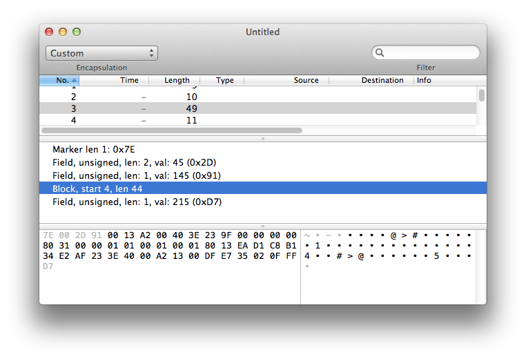

PacketParser for OS X
=====================

PacketParser is a tool for displaying structured binary data in a human-readable form. You can use
PacketParser to view binary data on serial ports or networks or in files on disk. It supports a
custom language for describing packets.

Contents:

.. toctree::
	:maxdepth: 2
	
	intro
	language
	codegen
	decoder
	glossary

Why?
----
Why did I create PacketParser when there are powerful tools like
`WireShark <http://www.wireshark.org>`_ available? For a few reasons.

*	I’m a Mac snob. I really prefer Mac-native user interfaces, and Cocoa
	is a stick-figure supermodel compared to bloated X11.
	
*	WireShark is hard to use with a raw data file or serial port data, and
	I have a lot of projects that communicate over serial port.

*	I invented a cool language for describing packets so an app could render
	them in a pretty way. I needed an app to host it in.

Indices and tables
==================

* :ref:`genindex`
* :ref:`modindex`
* :ref:`search`

